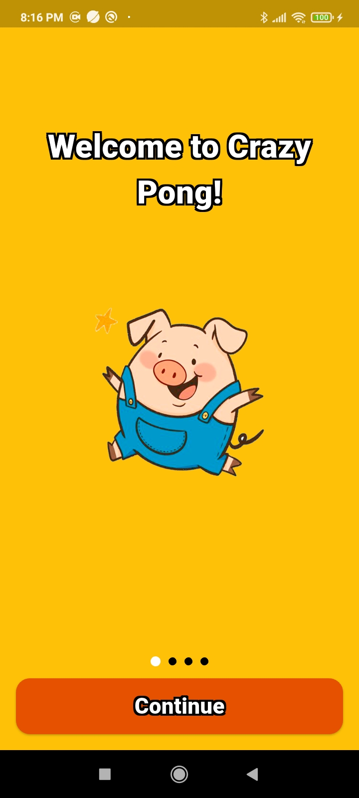
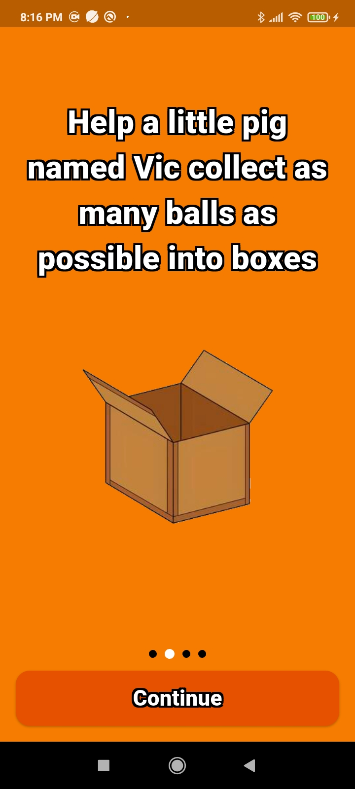
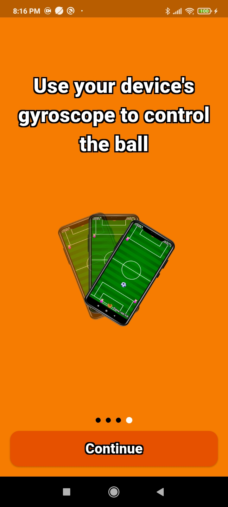
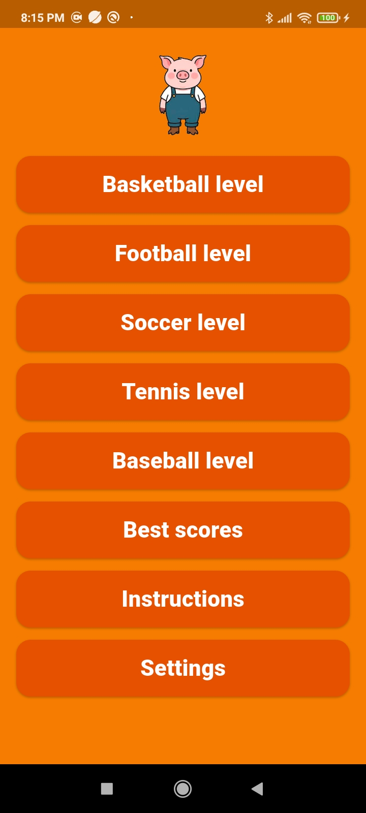
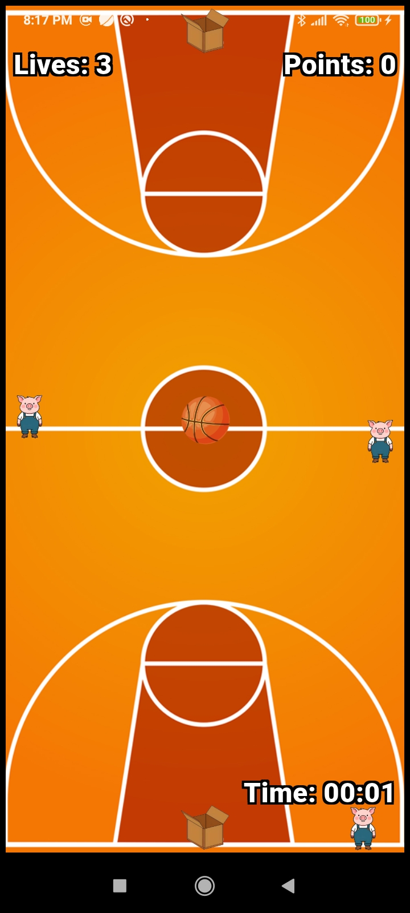
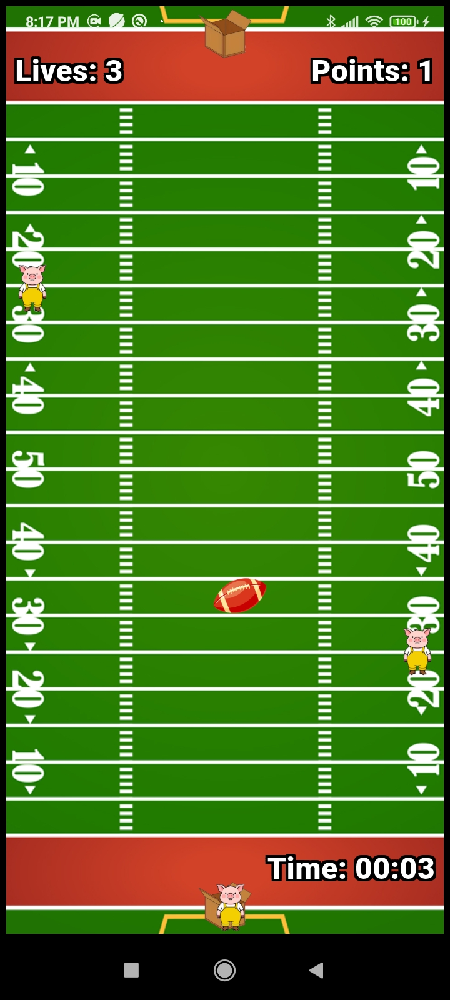
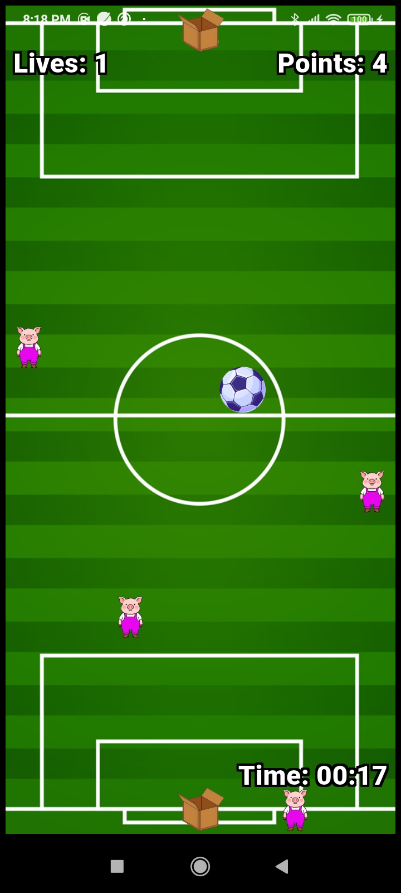
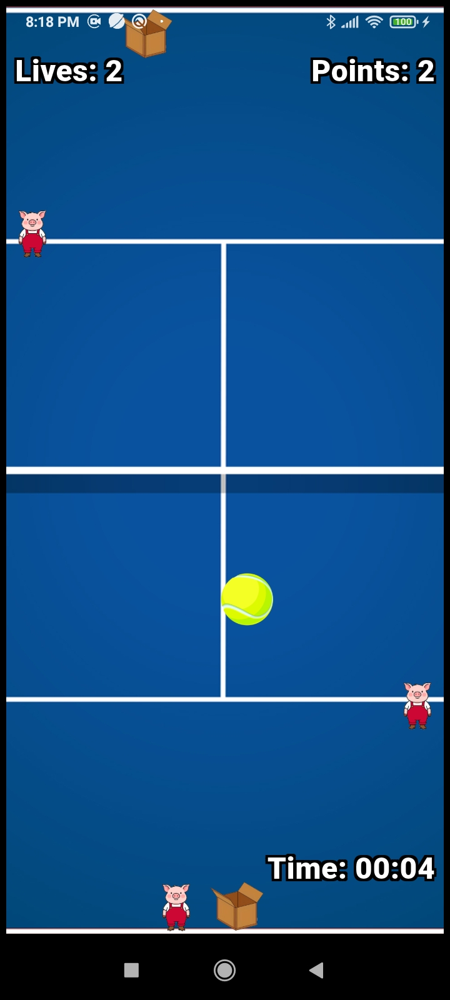
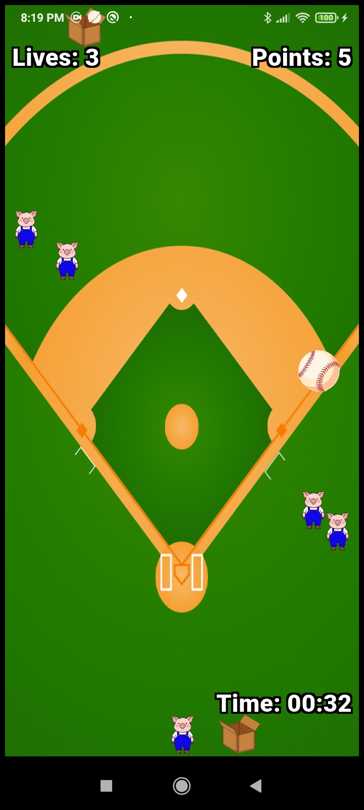

# Crazy Pong

Mobile arcade game for android/ios

## Screenshots

<table>
	<tr>
		<td></td>
		<td></td>
		<td></td>
		<td></td>
	</tr>
	<tr>
		<td></td>
		<td></td>
		<td></td>
		<td></td>
	</tr>
	<tr>
		<td></td>
		<td></td>
		<td></td>
		<td></td>
	</tr>
</table>

## CI (Continuous Integration)

This project includes CI automation to ensure code quality by running tests before pushing to git.

### Option 1: Local CI Script (Windows - PowerShell)

Run the local CI process using the provided PowerShell script:

```powershell
.\ci.ps1
```

Or with a custom commit message:

```powershell
.\ci.ps1 -CommitMessage "Your custom message"
```

The script will perform:

- Run all unit and widget tests with 'flutter test'
- Abort execution if any tests fail, with an error message
- Check for uncommitted changes
- Commit all changes with the specified message
- Push to the remote git repository

### Option 2: The same, but with a check that the project builds before push

```powershell
.\ci-build.ps1
```

Or with a custom commit message:

```powershell
.\ci-build.ps1 -CommitMessage "Your custom message"
```


